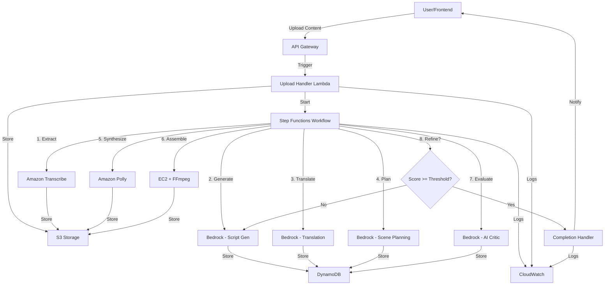

# Design Document: OrchestRAI Video Engine

## Overview

The OrchestRAI Video Engine is a cloud-native AI orchestration system built on AWS that transforms long-form content into engaging short-form videos across multiple Indian languages. The system implements a sophisticated Plan → Generate → Critique → Refine workflow with automated quality control.

The architecture follows event-driven microservices patterns, leveraging AWS Step Functions for orchestration, Amazon Bedrock for AI capabilities, and a suite of AWS services for storage, compute, and monitoring. The design emphasizes reliability, scalability, and cultural appropriateness for Indian audiences.

## Architecture

### High-Level Architecture



### Component Architecture

The system is organized into the following layers:

1. **API Layer**: API Gateway + Lambda functions for request handling
2. **Orchestration Layer**: Step Functions state machine managing workflow
3. **Processing Layer**: AI services (Bedrock, Transcribe, Polly) and compute (EC2/FFmpeg)
4. **Storage Layer**: S3 for media files, DynamoDB for metadata
5. **Observability Layer**: CloudWatch for logging, metrics, and alarms

### Data Flow

1. User uploads content → API Gateway → Upload Handler Lambda
2. Lambda stores content in S3 and initiates Step Functions workflow
3. Step Functions orchestrates sequential processing stages
4. Each stage reads from and writes to S3/DynamoDB
5. AI Critic evaluates output and triggers refinement if needed
6. Final output stored in S3 with metadata in DynamoDB
7. User notified with presigned download URL

## Components and Interfaces

### 1. API Gateway Layer

**Upload Endpoint**
```
POST /api/v1/upload
Headers:
  - x-api-key: string (required)
  - Content-Type: multipart/form-data or application/json

Request Body (Video):
  - file: binary (video file)
  - targetLanguages: string[] (optional, defaults to ["hi", "en"])
  - qualityThreshold: number (optional, defaults to 75)

Request Body (Text):
  - content: string (text article)
  - sourceLanguage: string (required)
  - targetLanguages: string[] (optional)
  - qualityThreshold: number (optional)

Response (200):
  - workflowId: string
  - status: "initiated"
  - estimatedCompletionTime: number (seconds)

Response (400):
  - error: string
  - code: string
```

**Status Endpoint**
```
GET /api/v1/status/{workflowId}
Headers:
  - x-api-key: string (required)

Response (200):
  - workflowId: string
  - status: "processing" | "completed" | "failed"
  - currentStage: string
  - progress: number (0-100)
  - qualityScore: number (if completed)
  - error: string (if failed)

Response (404):
  - error: "Workflow not found"
```

**Video Retrieval Endpoint**
```
GET /api/v1/video/{videoId}
Headers:
  - x-api-key: string (required)

Query Parameters:
  - language: string (optional, defaults to source language)

Response (200):
  - videoId: string
  - videoUrl: string (presigned S3 URL)
  - subtitleUrl: string (presigned S3 URL)
  - duration: number (seconds)
  - language: string
  - qualityScore: number
  - metadata: object

Response (404):
  - error: "Video not found"
```

### 2. Upload Handler Lambda

**Responsibilities:**
- Validate uploaded content (file size, format, duration)
- Generate unique content ID
- Store content in S3 with appropriate prefix
- Create initial metadata record in DynamoDB
- Initiate Step Functions workflow
- Return workflow ID to user

**Interface:**
```typescript
interface UploadHandlerInput {
  file?: Buffer;
  content?: string;
  sourceLanguage?: string;
  targetLanguages: string[];
  qualityThreshold: number;
  userId: string;
}

interface UploadHandlerOutput {
  workflowId: string;
  contentId: string;
  s3Key: string;
  status: string;
}
```

**Error Handling:**
- Invalid file format → 400 error with supported formats
- File too large (>500MB) → 413 error
- Missing required fields → 400 error with field details
- S3 upload failure → 500 error with retry suggestion

### 3. Step Functions Workflow

**State Machine Definition:**

```json
{
  "Comment": "OrchestRAI Video Generation Pipeline",
  "StartAt": "ExtractTranscript",
  "States": {
    "ExtractTranscript": {
      "Type": "Task",
      "Resource": "arn:aws:states:::lambda:invoke",
      "Parameters": {
        "FunctionName": "TranscriptExtractorFunction",
        "Payload.$": "$"
      },
      "Retry": [
        {
          "ErrorEquals": ["States.TaskFailed"],
          "IntervalSeconds": 2,
          "MaxAttempts": 3,
          "BackoffRate": 2.0
        }
      ],
      "Next": "GenerateScript"
    },
    "GenerateScript": {
      "Type": "Task",
      "Resource": "arn:aws:states:::lambda:invoke",
      "Parameters": {
        "FunctionName": "ScriptGeneratorFunction",
        "Payload.$": "$"
      },
      "Retry": [
        {
          "ErrorEquals": ["States.TaskFailed"],
          "IntervalSeconds": 2,
          "MaxAttempts": 3,
          "BackoffRate": 2.0
        }
      ],
      "Next": "TranslateScript"
    },
    "TranslateScript": {
      "Type": "Task",
      "Resource": "arn:aws:states:::lambda:invoke",
      "Next": "PlanScenes"
    },
    "PlanScenes": {
      "Type": "Task",
      "Resource": "arn:aws:states:::lambda:invoke",
      "Next": "SynthesizeVoice"
    },
    "SynthesizeVoice": {
      "Type": "Task",
      "Resource": "arn:aws:states:::lambda:invoke",
      "Next": "AssembleVideo"
    },
    "AssembleVideo": {
      "Type": "Task",
      "Resource": "arn:aws:states:::lambda:invoke",
      "Next": "EvaluateQuality"
    },
    "EvaluateQuality": {
      "Type": "Task",
      "Resource": "arn:aws:states:::lambda:invoke",
      "Next": "CheckQualityThreshold"
    },
    "CheckQualityThreshold": {
      "Type": "Choice",
      "Choices": [
        {
          "Variable": "$.qualityScore",
          "NumericGreaterThanEquals": 75,
          "Next": "FinalizeOutput"
        },
        {
          "Variable": "$.iterationCount",
          "NumericGreaterThanEquals": 3,
          "Next": "FlagForReview"
        }
      ],
      "Default": "IncrementIteration"
    },
    "IncrementIteration": {
      "Type": "Pass",
      "Parameters": {
        "iterationCount.$": "States.MathAdd($.iterationCount, 1)",
        "feedback.$": "$.criticFeedback"
      },
      "Next": "GenerateScript"
    },
    "FlagForReview": {
      "Type": "Task",
      "Resource": "arn:aws:states:::lambda:invoke",
      "End": true
    },
    "FinalizeOutput": {
      "Type": "Task",
      "Resource": "arn:aws:states:::lambda:invoke",
      "End": true
    }
  }
}
```

### 4. Transcript Extractor

**Responsibilities:**
- Determine if content is video or text
- For video: initiate Amazon Transcribe job
- Poll for transcription completion
- Store transcript in S3 and reference in DynamoDB
- For text: pass through directly

**Interface:**
```typescript
interface TranscriptExtractorInput {
  contentId: string;
  s3Key: string;
  contentType: "video" | "text";
  sourceLanguage?: string;
}

interface TranscriptExtractorOutput {
  contentId: string;
  transcriptS3Key: string;
  transcript: string;
  segments: TranscriptSegment[];
  language: string;
}

interface TranscriptSegment {
  startTime: number;
  endTime: number;
  text: string;
  confidence: number;
}
```

**Amazon Transcribe Configuration:**
- Language identification: automatic for video, specified for text
- Vocabulary filtering: enabled for profanity
- Speaker identification: disabled (not needed for short-form)
- Output format: JSON with timestamps

### 5. Script Generator

**Responsibilities:**
- Analyze transcript using Amazon Bedrock
- Identify key highlights and engaging moments
- Generate hook (first 3 seconds)
- Create main content scenes (3-5 scenes)
- Generate call-to-action (last 3 seconds)
- Ensure cultural appropriateness
- Store script in DynamoDB with version tracking

**Interface:**
```typescript
interface ScriptGeneratorInput {
  contentId: string;
  transcript: string;
  segments: TranscriptSegment[];
  targetDuration: number; // 30-90 seconds
  iterationCount: number;
  feedback?: CriticFeedback;
}

interface ScriptGeneratorOutput {
  contentId: string;
  scriptId: string;
  hook: ScriptSegment;
  scenes: ScriptSegment[];
  cta: ScriptSegment;
  totalDuration: number;
  version: number;
}

interface ScriptSegment {
  text: string;
  duration: number;
  sourceTimestamps?: { start: number; end: number };
  emphasis: "high" | "medium" | "low";
}
```

**Bedrock Prompt Template:**
```
You are an expert video script writer specializing in short-form content for Indian audiences.

Analyze the following transcript and create an engaging 60-second video script.

Transcript:
{transcript}

Requirements:
- Create a compelling 3-second hook that grabs attention
- Identify 3-5 key highlights from the content
- Ensure cultural appropriateness for Indian audiences
- End with a clear call-to-action
- Total duration: 60 seconds
- Use simple, conversational language

{feedback_section}

Output format:
{
  "hook": {"text": "...", "duration": 3},
  "scenes": [
    {"text": "...", "duration": 15, "sourceTimestamps": {"start": 120, "end": 135}},
    ...
  ],
  "cta": {"text": "...", "duration": 3}
}
```

### 6. Translation Service

**Responsibilities:**
- Translate script to target languages using Bedrock
- Preserve cultural context and idioms
- Maintain semantic alignment
- Flag culturally inappropriate translations
- Store translations in DynamoDB

**Interface:**
```typescript
interface TranslationInput {
  contentId: string;
  scriptId: string;
  sourceLanguage: string;
  targetLanguages: string[];
  script: ScriptGeneratorOutput;
}

interface TranslationOutput {
  contentId: string;
  translations: Map<string, TranslatedScript>;
}

interface TranslatedScript {
  language: string;
  hook: string;
  scenes: string[];
  cta: string;
  culturalFlags: string[];
}
```

**Supported Languages:**
- Hindi (hi)
- English (en)
- Tamil (ta)
- Telugu (te)
- Bengali (bn)
- Marathi (mr)
- Gujarati (gu)
- Kannada (kn)
- Malayalam (ml)
- Punjabi (pa)

### 7. Scene Planner

**Responsibilities:**
- Generate visual descriptions for each scene
- Identify source video segments to extract
- Specify asset types (video clip, text overlay, transition)
- Ensure narrative flow and coherence
- Store scene plan in DynamoDB

**Interface:**
```typescript
interface ScenePlannerInput {
  contentId: string;
  scriptId: string;
  script: ScriptGeneratorOutput;
  sourceVideoS3Key: string;
}

interface ScenePlannerOutput {
  contentId: string;
  scenePlanId: string;
  scenes: ScenePlan[];
}

interface ScenePlan {
  sceneNumber: number;
  visualDescription: string;
  sourceTimestamp: { start: number; end: number };
  assetType: "video_clip" | "text_overlay" | "image";
  transition: "cut" | "fade" | "dissolve";
  duration: number;
  textOverlay?: TextOverlay;
}

interface TextOverlay {
  text: string;
  position: "top" | "center" | "bottom";
  style: "bold" | "normal";
  fontSize: number;
}
```

### 8. Voice Synthesizer

**Responsibilities:**
- Convert translated scripts to speech using Amazon Polly
- Generate audio for each language version
- Synchronize audio duration with scene timing
- Store audio files in S3
- Support multiple Indian language voices

**Interface:**
```typescript
interface VoiceSynthesizerInput {
  contentId: string;
  translations: Map<string, TranslatedScript>;
  scenePlan: ScenePlannerOutput;
}

interface VoiceSynthesizerOutput {
  contentId: string;
  audioFiles: Map<string, AudioFile>;
}

interface AudioFile {
  language: string;
  s3Key: string;
  duration: number;
  format: "mp3";
  sampleRate: 48000;
}
```

**Polly Configuration:**
- Engine: Neural (for natural-sounding voices)
- Output format: MP3
- Sample rate: 48kHz
- Voice selection: Language-appropriate neural voices

### 9. Video Assembler

**Responsibilities:**
- Extract video segments from source using FFmpeg
- Convert to 9:16 aspect ratio
- Overlay audio narration
- Burn subtitles with readable styling
- Apply scene transitions
- Generate MP4 output with H.264 encoding
- Store draft video in S3

**Interface:**
```typescript
interface VideoAssemblerInput {
  contentId: string;
  sourceVideoS3Key: string;
  scenePlan: ScenePlannerOutput;
  audioFile: AudioFile;
  language: string;
}

interface VideoAssemblerOutput {
  contentId: string;
  draftVideoS3Key: string;
  duration: number;
  resolution: { width: 1080; height: 1920 };
  format: "mp4";
  codec: "h264";
}
```

**FFmpeg Processing Pipeline:**
```bash
# 1. Extract segments
ffmpeg -i source.mp4 -ss {start} -to {end} -c copy segment_{n}.mp4

# 2. Convert to 9:16 with padding/crop
ffmpeg -i segment.mp4 -vf "scale=1080:1920:force_original_aspect_ratio=decrease,pad=1080:1920:(ow-iw)/2:(oh-ih)/2" segment_916.mp4

# 3. Add audio overlay
ffmpeg -i segment_916.mp4 -i narration.mp3 -c:v copy -c:a aac -map 0:v:0 -map 1:a:0 segment_audio.mp4

# 4. Burn subtitles
ffmpeg -i segment_audio.mp4 -vf "subtitles=subtitles.srt:force_style='FontSize=24,PrimaryColour=&HFFFFFF,OutlineColour=&H000000,Outline=2'" segment_final.mp4

# 5. Concatenate all segments
ffmpeg -f concat -i segments.txt -c copy final_draft.mp4
```

**Subtitle Styling:**
- Font: Arial Bold
- Size: 24pt
- Color: White with black outline
- Position: Bottom third of screen
- Background: Semi-transparent black box

### 10. AI Critic

**Responsibilities:**
- Evaluate draft video quality using Amazon Bedrock
- Score semantic alignment (0-100)
- Score pacing and engagement (0-100)
- Score caption readability (0-100)
- Score cultural appropriateness (0-100)
- Calculate weighted overall score
- Provide actionable feedback for refinement
- Store evaluation in DynamoDB

**Interface:**
```typescript
interface AICriticInput {
  contentId: string;
  draftVideoS3Key: string;
  originalTranscript: string;
  script: ScriptGeneratorOutput;
  language: string;
}

interface AICriticOutput {
  contentId: string;
  evaluationId: string;
  scores: QualityScores;
  overallScore: number;
  feedback: CriticFeedback;
  timestamp: string;
}

interface QualityScores {
  semanticAlignment: number; // 0-100
  pacing: number; // 0-100
  readability: number; // 0-100
  culturalAppropriateness: number; // 0-100
}

interface CriticFeedback {
  strengths: string[];
  weaknesses: string[];
  suggestions: string[];
  criticalIssues: string[];
}
```

**Scoring Weights:**
- Semantic Alignment: 40%
- Pacing: 25%
- Readability: 20%
- Cultural Appropriateness: 15%

**Bedrock Evaluation Prompt:**
```
You are an expert video quality evaluator specializing in short-form content for Indian audiences.

Evaluate the following video based on these criteria:

Original Content Summary:
{transcript_summary}

Generated Script:
{script}

Video Analysis:
{video_metadata}

Evaluate on a scale of 0-100:

1. Semantic Alignment: Does the video accurately represent the original content?
2. Pacing: Is the video engaging with good rhythm and flow?
3. Readability: Are captions clear, well-timed, and easy to read?
4. Cultural Appropriateness: Is the content suitable for Indian audiences?

Provide:
- Numerical scores for each criterion
- Specific strengths and weaknesses
- Actionable suggestions for improvement
- Any critical issues that must be addressed

Output format:
{
  "scores": {
    "semanticAlignment": 85,
    "pacing": 70,
    "readability": 90,
    "culturalAppropriateness": 95
  },
  "feedback": {
    "strengths": ["..."],
    "weaknesses": ["..."],
    "suggestions": ["..."],
    "criticalIssues": ["..."]
  }
}
```

### 11. Refinement Loop Controller

**Responsibilities:**
- Compare overall score to quality threshold
- Decide whether to refine or finalize
- Track iteration count
- Pass critic feedback to script generator
- Prevent infinite loops (max 3 iterations)
- Flag videos for manual review if threshold not met

**Interface:**
```typescript
interface RefinementDecision {
  shouldRefine: boolean;
  reason: string;
  iterationCount: number;
  feedbackToApply: CriticFeedback;
}

function makeRefinementDecision(
  qualityScore: number,
  threshold: number,
  iterationCount: number,
  feedback: CriticFeedback
): RefinementDecision {
  if (qualityScore >= threshold) {
    return {
      shouldRefine: false,
      reason: "Quality threshold met",
      iterationCount,
      feedbackToApply: null
    };
  }
  
  if (iterationCount >= 3) {
    return {
      shouldRefine: false,
      reason: "Maximum iterations reached",
      iterationCount,
      feedbackToApply: null
    };
  }
  
  return {
    shouldRefine: true,
    reason: "Quality below threshold",
    iterationCount: iterationCount + 1,
    feedbackToApply: feedback
  };
}
```

### 12. Completion Handler Lambda

**Responsibilities:**
- Generate presigned S3 URLs for video and subtitles
- Update final status in DynamoDB
- Send notification to user
- Clean up intermediate artifacts (optional)
- Log completion metrics to CloudWatch

**Interface:**
```typescript
interface CompletionHandlerInput {
  contentId: string;
  finalVideoS3Key: string;
  subtitlesS3Key: string;
  qualityScore: number;
  language: string;
  metadata: VideoMetadata;
}

interface CompletionHandlerOutput {
  videoId: string;
  videoUrl: string;
  subtitleUrl: string;
  expiresIn: number; // seconds
  qualityScore: number;
}
```

## Data Models

### DynamoDB Tables

**ContentMetadata Table**
```typescript
interface ContentMetadata {
  contentId: string; // Partition Key
  userId: string;
  uploadTimestamp: string;
  contentType: "video" | "text";
  sourceS3Key: string;
  sourceLanguage: string;
  targetLanguages: string[];
  qualityThreshold: number;
  status: "uploaded" | "processing" | "completed" | "failed";
  workflowId: string;
  fileSize: number;
  duration?: number;
}
```

**WorkflowState Table**
```typescript
interface WorkflowState {
  workflowId: string; // Partition Key
  contentId: string;
  currentStage: string;
  progress: number; // 0-100
  startTime: string;
  lastUpdateTime: string;
  estimatedCompletionTime: string;
  stageHistory: StageRecord[];
}

interface StageRecord {
  stage: string;
  status: "started" | "completed" | "failed";
  timestamp: string;
  duration: number;
  error?: string;
}
```

**ScriptVersions Table**
```typescript
interface ScriptVersion {
  scriptId: string; // Partition Key
  version: number; // Sort Key
  contentId: string;
  hook: ScriptSegment;
  scenes: ScriptSegment[];
  cta: ScriptSegment;
  totalDuration: number;
  createdAt: string;
  iterationCount: number;
  appliedFeedback?: string[];
}
```

**Translations Table**
```typescript
interface Translation {
  translationId: string; // Partition Key
  language: string; // Sort Key
  contentId: string;
  scriptId: string;
  hook: string;
  scenes: string[];
  cta: string;
  culturalFlags: string[];
  createdAt: string;
}
```

**ScenePlans Table**
```typescript
interface ScenePlanRecord {
  scenePlanId: string; // Partition Key
  contentId: string;
  scriptId: string;
  scenes: ScenePlan[];
  createdAt: string;
}
```

**QualityEvaluations Table**
```typescript
interface QualityEvaluation {
  evaluationId: string; // Partition Key
  contentId: string;
  draftVideoS3Key: string;
  scores: QualityScores;
  overallScore: number;
  feedback: CriticFeedback;
  iterationCount: number;
  timestamp: string;
  language: string;
}
```

**FinalVideos Table**
```typescript
interface FinalVideo {
  videoId: string; // Partition Key
  contentId: string;
  language: string; // Sort Key
  videoS3Key: string;
  subtitlesS3Key: string;
  duration: number;
  resolution: { width: number; height: number };
  qualityScore: number;
  generationTime: number; // seconds
  createdAt: string;
  expiresAt: string;
  downloadCount: number;
}
```

### S3 Bucket Structure

```
orchestrai-content/
├── uploads/
│   ├── {contentId}/
│   │   └── source.{ext}
├── transcripts/
│   ├── {contentId}/
│   │   └── transcript.json
├── audio/
│   ├── {contentId}/
│   │   ├── {language}_v{version}.mp3
├── drafts/
│   ├── {contentId}/
│   │   ├── {language}_v{version}_draft.mp4
├── finals/
│   ├── {videoId}/
│   │   ├── {language}_final.mp4
│   │   └── {language}_subtitles.srt
└── temp/
    └── {contentId}/
        └── {various intermediate files}
```

## Error Handling

### Error Categories

1. **User Input Errors (4xx)**
   - Invalid file format
   - File too large
   - Missing required fields
   - Invalid language code
   - Invalid quality threshold

2. **Service Errors (5xx)**
   - Transcribe job failure
   - Bedrock API errors
   - Polly synthesis failure
   - FFmpeg processing errors
   - S3 upload/download failures
   - DynamoDB write failures

3. **Workflow Errors**
   - Stage timeout
   - Maximum retries exceeded
   - Quality threshold not met after max iterations

### Error Handling Strategies

**Retry with Exponential Backoff:**
- Transient service errors (Bedrock throttling, S3 timeouts)
- Initial retry: 2 seconds
- Backoff rate: 2.0
- Maximum attempts: 3

**Immediate Failure:**
- Invalid user input
- Unsupported file format
- Authentication failures

**Graceful Degradation:**
- If translation fails for one language, continue with others
- If subtitle generation fails, deliver video without subtitles
- If quality evaluation fails, use default passing score with warning

**Error Logging:**
```typescript
interface ErrorLog {
  errorId: string;
  workflowId: string;
  contentId: string;
  stage: string;
  errorType: string;
  errorMessage: string;
  stackTrace: string;
  timestamp: string;
  retryCount: number;
  context: Record<string, any>;
}
```

### Circuit Breaker Pattern

Implement circuit breaker for external service calls:
- Open circuit after 5 consecutive failures
- Half-open after 60 seconds
- Close after 2 successful calls

## Testing Strategy

The OrchestRAI Video Engine requires comprehensive testing across multiple dimensions: unit tests for individual components, property-based tests for universal correctness properties, integration tests for service interactions, and end-to-end tests for complete workflows.

### Unit Testing

Unit tests validate specific examples, edge cases, and error conditions for individual components:

**Upload Handler:**
- Valid video upload with all parameters
- Valid text upload with minimal parameters
- Invalid file format rejection
- File size limit enforcement
- Missing required field validation
- S3 upload failure handling

**Transcript Extractor:**
- Video transcription with timestamps
- Text passthrough without transcription
- Transcribe job failure recovery
- Language detection accuracy
- Segment parsing correctness

**Script Generator:**
- Hook generation within 3-second limit
- Scene extraction from transcript
- CTA generation
- Duration calculation accuracy
- Feedback incorporation in refinement

**Translation Service:**
- Accurate translation for each supported language
- Cultural flag detection
- Semantic preservation validation
- Error handling for unsupported languages

**Scene Planner:**
- Visual description generation
- Timestamp extraction accuracy
- Asset type assignment
- Transition selection logic

**Voice Synthesizer:**
- Audio generation for each language
- Duration synchronization
- Polly error handling
- Audio format validation

**Video Assembler:**
- Segment extraction accuracy
- 9:16 aspect ratio conversion
- Audio overlay synchronization
- Subtitle burning correctness
- FFmpeg error handling

**AI Critic:**
- Score calculation for each dimension
- Weighted average computation
- Feedback generation
- Critical issue detection

**Refinement Loop:**
- Threshold comparison logic
- Iteration count tracking
- Maximum iteration enforcement
- Feedback propagation

### Property-Based Testing

Property-based tests verify universal properties across all inputs using randomized test data. Each test should run a minimum of 100 iterations.


## Correctness Properties

A property is a characteristic or behavior that should hold true across all valid executions of a system—essentially, a formal statement about what the system should do. Properties serve as the bridge between human-readable specifications and machine-verifiable correctness guarantees.

### Property 1: Duration Validation

*For any* video file metadata, if the duration is between 5 and 30 minutes (inclusive), the system should accept it; otherwise, it should reject it with a validation error.

**Validates: Requirements 1.3**

### Property 2: Format Validation

*For any* uploaded file, if the format is MP4, MOV, or AVI, the system should accept it; otherwise, it should reject it with a format error.

**Validates: Requirements 1.4**

### Property 3: Error Message Completeness

*For any* upload failure scenario, the system should return a non-empty, descriptive error message to the user.

**Validates: Requirements 1.5**

### Property 4: Content ID Uniqueness

*For any* set of uploaded content items, all generated content IDs should be unique (no duplicates).

**Validates: Requirements 1.6**

### Property 5: Metadata Persistence Completeness

*For any* uploaded content, querying DynamoDB should return a record containing all required fields: contentId, uploadTimestamp, fileSize, contentType, and status.

**Validates: Requirements 1.7**

### Property 6: Transcript Storage Consistency

*For any* completed transcription, the transcript should be retrievable from S3 at the expected key location.

**Validates: Requirements 2.2**

### Property 7: Multi-Language Support

*For any* supported language code (hi, en, ta, te, bn, mr, gu, kn, ml, pa), the system should successfully process transcription, translation, and voice synthesis for that language.

**Validates: Requirements 2.3, 4.2, 6.2**

### Property 8: Transcription Error Handling

*For any* transcription failure, the system should create a CloudWatch log entry and send a user notification.

**Validates: Requirements 2.4**

### Property 9: Timestamp Preservation

*For any* transcription output, all segments should have valid timestamps where startTime < endTime and timestamps are non-negative.

**Validates: Requirements 2.5**

### Property 10: Script Structure Completeness

*For any* generated script, it should contain exactly three components: hook, scenes array (with at least one scene), and cta.

**Validates: Requirements 3.2**

### Property 11: Script Duration Constraints

*For any* generated script, the sum of durations for hook, all scenes, and cta should be between 30 and 90 seconds (inclusive).

**Validates: Requirements 3.3**

### Property 12: Retry Mechanism Consistency

*For any* component that implements retry logic (Script Generator, Voice Synthesizer, Orchestration Engine stages), failures should trigger up to 3 retry attempts with exponential backoff before final failure.

**Validates: Requirements 3.6, 6.5, 10.3**

### Property 13: Version Tracking

*For any* generated script, it should be stored in DynamoDB with a version number, and subsequent refinements should increment the version.

**Validates: Requirements 3.7**

### Property 14: Translation Completeness

*For any* script and list of target languages, the system should generate translations for all specified languages, and all translations should be stored in DynamoDB with correct language tags.

**Validates: Requirements 4.1, 4.6**

### Property 15: Scene Plan Completeness

*For any* finalized script, the scene planner should generate a scene plan where every scene has: visualDescription, sourceTimestamp (with valid start/end), assetType, and transition.

**Validates: Requirements 5.1, 5.2, 5.3**

### Property 16: Scene Sequence Ordering

*For any* scene plan stored in DynamoDB, scenes should have sequential scene numbers starting from 1 with no gaps.

**Validates: Requirements 5.4**

### Property 17: Audio Format Compliance

*For any* generated audio file, it should be in MP3 format with a 48kHz sample rate, and should be stored in S3 with language-specific naming convention.

**Validates: Requirements 6.3, 6.4**

### Property 18: Audio-Scene Duration Synchronization

*For any* generated audio and corresponding scene plan, the total audio duration should match the total scene plan duration within a tolerance of ±2 seconds.

**Validates: Requirements 6.6**

### Property 19: Video Aspect Ratio Compliance

*For any* output video generated by the Video Assembler, the aspect ratio should be 9:16 (width:height = 1080:1920).

**Validates: Requirements 7.2**

### Property 20: Audio Track Presence

*For any* assembled video, it should contain an audio track with the narration audio overlaid.

**Validates: Requirements 7.3**

### Property 21: Subtitle Presence and Styling

*For any* assembled video with subtitles, the video should have burned-in subtitles with font size ≥ 24pt and visible contrast (white text with black outline).

**Validates: Requirements 7.4**

### Property 22: Transition Application

*For any* scene plan specifying transitions, the assembled video should include those transitions between consecutive scenes.

**Validates: Requirements 7.5**

### Property 23: Video Format Compliance

*For any* output video, it should be in MP4 format with H.264 codec encoding.

**Validates: Requirements 7.6**

### Property 24: Draft Video Storage Uniqueness

*For any* set of draft videos, all should be stored in S3 with unique identifiers (no duplicate keys).

**Validates: Requirements 7.7**

### Property 25: Error Logging Completeness

*For any* system error (transcription, assembly, evaluation, etc.), a CloudWatch log entry should be created containing: errorId, timestamp, stage, errorMessage, and stackTrace.

**Validates: Requirements 2.4, 7.8, 12.3**

### Property 26: Quality Score Range Validity

*For any* AI Critic evaluation, all individual scores (semanticAlignment, pacing, readability, culturalAppropriateness) should be numbers between 0 and 100 (inclusive).

**Validates: Requirements 8.2, 8.3, 8.4, 8.5**

### Property 27: Weighted Average Calculation

*For any* set of individual quality scores, the overall score should equal the weighted average: (semanticAlignment × 0.4) + (pacing × 0.25) + (readability × 0.2) + (culturalAppropriateness × 0.15).

**Validates: Requirements 8.6**

### Property 28: Evaluation Storage

*For any* completed evaluation, the scores and feedback should be retrievable from DynamoDB using the evaluationId.

**Validates: Requirements 8.7**

### Property 29: Refinement Trigger Logic

*For any* quality score and threshold, if score < threshold and iterationCount < 3, the system should trigger regeneration; if score ≥ threshold, it should mark as final; if iterationCount ≥ 3, it should flag for review.

**Validates: Requirements 9.1, 9.4, 9.5**

### Property 30: Feedback Propagation

*For any* refinement iteration, the AI Critic feedback from the previous iteration should be passed to the Script Generator for parameter adjustment.

**Validates: Requirements 9.2**

### Property 31: Iteration Limit Enforcement

*For any* workflow, the refinement loop should never exceed 3 regeneration attempts.

**Validates: Requirements 9.3**

### Property 32: Iteration History Tracking

*For any* refinement process, all iterations should be stored in DynamoDB with their respective scores, feedback, and adjustments.

**Validates: Requirements 9.6**

### Property 33: Pipeline Stage Ordering

*For any* workflow execution, stages should execute in this exact sequence: extract → generate → translate → plan → synthesize → assemble → evaluate → (refine if needed).

**Validates: Requirements 10.2**

### Property 34: Stage Failure Notification

*For any* stage that fails after 3 retry attempts, the workflow should halt and a user notification should be sent.

**Validates: Requirements 10.4**

### Property 35: Stage Transition Logging

*For any* workflow, all stage transitions should be logged in CloudWatch with stage name, status, timestamp, and duration.

**Validates: Requirements 10.5**

### Property 36: Workflow Status Tracking

*For any* stage transition, the workflow status in DynamoDB should be updated to reflect the current stage and progress.

**Validates: Requirements 10.6**

### Property 37: Completion Notification

*For any* successfully completed workflow, the user should receive a notification containing the final video URL.

**Validates: Requirements 10.7**

### Property 38: Final Video Storage

*For any* video that passes quality evaluation, it should be stored in S3 under the finals/ prefix with a unique videoId.

**Validates: Requirements 11.1**

### Property 39: Presigned URL Generation

*For any* final video, a presigned S3 URL should be generated with an expiration time of exactly 7 days (604800 seconds) from generation.

**Validates: Requirements 11.2**

### Property 40: Final Metadata Completeness

*For any* final video, the DynamoDB record should contain all required fields: videoId, qualityScore, language, duration, generationTime, and createdAt.

**Validates: Requirements 11.3**

### Property 41: Subtitle File Availability

*For any* final video in a specific language, an SRT subtitle file should be available in S3 for that language.

**Validates: Requirements 11.4**

### Property 42: Artifact Retention

*For any* workflow, all intermediate artifacts (scripts, audio, drafts) should remain in S3 for at least 30 days after creation.

**Validates: Requirements 11.6**

### Property 43: API Request Logging

*For any* API request, both the request payload and response should be logged in CloudWatch with timestamp and correlation ID.

**Validates: Requirements 12.1**

### Property 44: Stage Duration Metrics

*For any* completed pipeline stage, the duration should be recorded as a CloudWatch metric with stage name as a dimension.

**Validates: Requirements 12.2**

### Property 45: Cost Metrics Tracking

*For any* usage of Bedrock, Polly, or Transcribe, the associated cost should be tracked and recorded as a CloudWatch metric.

**Validates: Requirements 12.5**

### Property 46: Dashboard Metrics Availability

*For any* time period, the system should provide metrics for: total videos generated, average quality score, and average processing time.

**Validates: Requirements 12.6**

### Property 47: Correlation ID Presence

*For any* system error, the error log should include a correlation ID that can be used to trace the request across all services.

**Validates: Requirements 12.7**

### Property 48: Authentication Enforcement

*For any* API request without a valid API key, the system should return a 401 Unauthorized error.

**Validates: Requirements 13.4**

### Property 49: Input Validation

*For any* API request with an invalid payload (missing required fields, invalid types, out-of-range values), the system should return a 400 Bad Request error with a descriptive message.

**Validates: Requirements 13.5**

### Property 50: Rate Limiting

*For any* API key, if more than 100 requests are made within a 60-second window, subsequent requests should be rejected with a 429 Too Many Requests error.

**Validates: Requirements 13.6**

### Property 51: HTTP Status Code Correctness

*For any* API operation, the returned HTTP status code should match the operation outcome: 200 for success, 400 for client errors, 401 for auth failures, 404 for not found, 429 for rate limits, 500 for server errors.

**Validates: Requirements 13.7**

### Property 52: Error Response Format

*For any* failed API request, the error response should be a JSON object containing both an error message (string) and an error code (string).

**Validates: Requirements 13.8**

## Testing Strategy

The OrchestRAI Video Engine requires comprehensive testing across multiple dimensions to ensure reliability, correctness, and quality.

### Dual Testing Approach

The system employs both unit testing and property-based testing as complementary strategies:

- **Unit tests** validate specific examples, edge cases, and error conditions
- **Property tests** verify universal properties across all inputs through randomization
- Together, they provide comprehensive coverage: unit tests catch concrete bugs, property tests verify general correctness

### Unit Testing Focus Areas

Unit tests should focus on:

1. **Specific Examples**
   - Successful video upload with all parameters
   - Text article upload with minimal parameters
   - Script generation with typical transcript
   - Translation for a specific language pair
   - Video assembly with standard scene plan

2. **Edge Cases**
   - Empty transcript handling
   - Single-scene script generation
   - Maximum duration video (30 minutes)
   - Minimum duration video (5 minutes)
   - Script at exactly 30 seconds and 90 seconds

3. **Error Conditions**
   - Transcribe service unavailable
   - Bedrock API throttling
   - Polly synthesis failure
   - FFmpeg processing error
   - S3 upload timeout
   - DynamoDB write failure

4. **Integration Points**
   - API Gateway to Lambda integration
   - Lambda to Step Functions workflow initiation
   - Step Functions to service Lambda invocations
   - Service Lambda to AWS service calls (Transcribe, Bedrock, Polly)
   - CloudWatch logging integration

### Property-Based Testing Configuration

**Library Selection:**
- **Python**: Use Hypothesis for property-based testing
- **TypeScript/JavaScript**: Use fast-check for property-based testing
- **Java**: Use jqwik for property-based testing

**Test Configuration:**
- Minimum 100 iterations per property test (due to randomization)
- Each property test must reference its design document property
- Tag format: `# Feature: ai-video-orchestration-engine, Property {number}: {property_text}`

**Example Property Test Structure (Python with Hypothesis):**

```python
from hypothesis import given, strategies as st
import pytest

# Feature: ai-video-orchestration-engine, Property 11: Script Duration Constraints
@given(
    hook_duration=st.floats(min_value=1, max_value=10),
    scene_durations=st.lists(st.floats(min_value=5, max_value=30), min_size=1, max_size=5),
    cta_duration=st.floats(min_value=1, max_value=10)
)
def test_script_duration_within_bounds(hook_duration, scene_durations, cta_duration):
    """Property 11: For any generated script, total duration should be 30-90 seconds"""
    script = generate_script(hook_duration, scene_durations, cta_duration)
    total_duration = script.hook.duration + sum(s.duration for s in script.scenes) + script.cta.duration
    
    assert 30 <= total_duration <= 90, f"Script duration {total_duration}s outside bounds [30, 90]"

# Feature: ai-video-orchestration-engine, Property 27: Weighted Average Calculation
@given(
    semantic=st.floats(min_value=0, max_value=100),
    pacing=st.floats(min_value=0, max_value=100),
    readability=st.floats(min_value=0, max_value=100),
    cultural=st.floats(min_value=0, max_value=100)
)
def test_overall_score_weighted_average(semantic, pacing, readability, cultural):
    """Property 27: Overall score equals weighted average of individual scores"""
    scores = QualityScores(
        semanticAlignment=semantic,
        pacing=pacing,
        readability=readability,
        culturalAppropriateness=cultural
    )
    
    expected = (semantic * 0.4) + (pacing * 0.25) + (readability * 0.2) + (cultural * 0.15)
    actual = calculate_overall_score(scores)
    
    assert abs(actual - expected) < 0.01, f"Overall score {actual} != expected {expected}"
```

**Example Property Test Structure (TypeScript with fast-check):**

```typescript
import fc from 'fast-check';
import { describe, it, expect } from 'vitest';

describe('OrchestRAI Video Engine Properties', () => {
  // Feature: ai-video-orchestration-engine, Property 4: Content ID Uniqueness
  it('Property 4: All generated content IDs should be unique', () => {
    fc.assert(
      fc.property(
        fc.array(fc.record({
          file: fc.string(),
          userId: fc.string()
        }), { minLength: 2, maxLength: 100 }),
        (uploads) => {
          const contentIds = uploads.map(upload => generateContentId(upload));
          const uniqueIds = new Set(contentIds);
          expect(uniqueIds.size).toBe(contentIds.length);
        }
      ),
      { numRuns: 100 }
    );
  });

  // Feature: ai-video-orchestration-engine, Property 19: Video Aspect Ratio Compliance
  it('Property 19: Output videos should have 9:16 aspect ratio', () => {
    fc.assert(
      fc.property(
        fc.record({
          sourceVideo: fc.string(),
          scenePlan: fc.array(fc.record({
            start: fc.float({ min: 0, max: 1800 }),
            end: fc.float({ min: 0, max: 1800 })
          }))
        }),
        async (input) => {
          const video = await assembleVideo(input);
          const aspectRatio = video.width / video.height;
          expect(aspectRatio).toBeCloseTo(9/16, 2);
          expect(video.width).toBe(1080);
          expect(video.height).toBe(1920);
        }
      ),
      { numRuns: 100 }
    );
  });
});
```

### Integration Testing

Integration tests validate interactions between components:

1. **Upload to Transcription Flow**
   - Upload video → Store in S3 → Trigger Transcribe → Store transcript
   - Verify end-to-end data flow

2. **Script Generation to Translation Flow**
   - Generate script → Translate to multiple languages → Store all versions
   - Verify all languages processed

3. **Scene Planning to Video Assembly Flow**
   - Plan scenes → Synthesize voice → Assemble video
   - Verify synchronized output

4. **Evaluation to Refinement Flow**
   - Evaluate video → Trigger refinement if needed → Regenerate
   - Verify feedback loop

5. **Complete Pipeline**
   - Upload → Process → Evaluate → Deliver
   - Verify end-to-end workflow

### End-to-End Testing

End-to-end tests validate complete user workflows:

1. **Happy Path**: Upload video → Receive high-quality output on first attempt
2. **Refinement Path**: Upload video → Low score → Refinement → Pass on second attempt
3. **Multi-Language Path**: Upload video → Generate versions in 3 languages → All pass
4. **Error Recovery Path**: Upload video → Service failure → Retry → Success
5. **Maximum Iteration Path**: Upload video → 3 refinements → Flag for review

### Performance Testing

Performance tests validate system scalability and responsiveness:

1. **Throughput**: Process 100 concurrent uploads
2. **Latency**: Measure end-to-end processing time for various video lengths
3. **Resource Usage**: Monitor Lambda memory, EC2 CPU, S3 bandwidth
4. **Cost Efficiency**: Track AWS service costs per video generated

### Monitoring and Observability Testing

Validate that monitoring and logging work correctly:

1. **Log Completeness**: Verify all stages log to CloudWatch
2. **Metric Accuracy**: Verify CloudWatch metrics match actual operations
3. **Alarm Triggering**: Verify alarms fire when thresholds exceeded
4. **Correlation Tracing**: Verify correlation IDs propagate through all services

### Test Data Generation

For property-based testing, generate realistic test data:

**Video Metadata:**
```python
video_metadata = st.fixed_dict({
    'duration': st.integers(min_value=300, max_value=1800),  # 5-30 minutes in seconds
    'format': st.sampled_from(['mp4', 'mov', 'avi']),
    'size': st.integers(min_value=1_000_000, max_value=500_000_000),  # 1MB to 500MB
    'language': st.sampled_from(['hi', 'en', 'ta', 'te', 'bn', 'mr', 'gu', 'kn', 'ml', 'pa'])
})
```

**Transcript Segments:**
```python
transcript_segment = st.fixed_dict({
    'startTime': st.floats(min_value=0, max_value=1800),
    'endTime': st.floats(min_value=0, max_value=1800),
    'text': st.text(min_size=10, max_size=200),
    'confidence': st.floats(min_value=0.5, max_value=1.0)
}).filter(lambda s: s['startTime'] < s['endTime'])
```

**Quality Scores:**
```python
quality_scores = st.fixed_dict({
    'semanticAlignment': st.floats(min_value=0, max_value=100),
    'pacing': st.floats(min_value=0, max_value=100),
    'readability': st.floats(min_value=0, max_value=100),
    'culturalAppropriateness': st.floats(min_value=0, max_value=100)
})
```

### Test Environment Setup

**Local Development:**
- Use LocalStack for AWS service mocking (S3, DynamoDB, Step Functions)
- Use mocked Bedrock/Polly/Transcribe responses
- Use sample video files for FFmpeg testing

**CI/CD Pipeline:**
- Run unit tests on every commit
- Run property tests (100 iterations) on every PR
- Run integration tests on staging environment
- Run E2E tests before production deployment

**AWS Test Environment:**
- Separate AWS account for testing
- Isolated S3 buckets and DynamoDB tables
- Step Functions with test-specific state machines
- CloudWatch log groups with test prefix

### Test Coverage Goals

- **Unit Test Coverage**: Minimum 80% code coverage
- **Property Test Coverage**: All 52 properties implemented
- **Integration Test Coverage**: All component interactions tested
- **E2E Test Coverage**: All user workflows tested

### Continuous Testing

- Run unit tests on every commit (< 5 minutes)
- Run property tests on every PR (< 15 minutes)
- Run integration tests nightly (< 30 minutes)
- Run E2E tests before each release (< 1 hour)
- Run performance tests weekly (< 2 hours)
